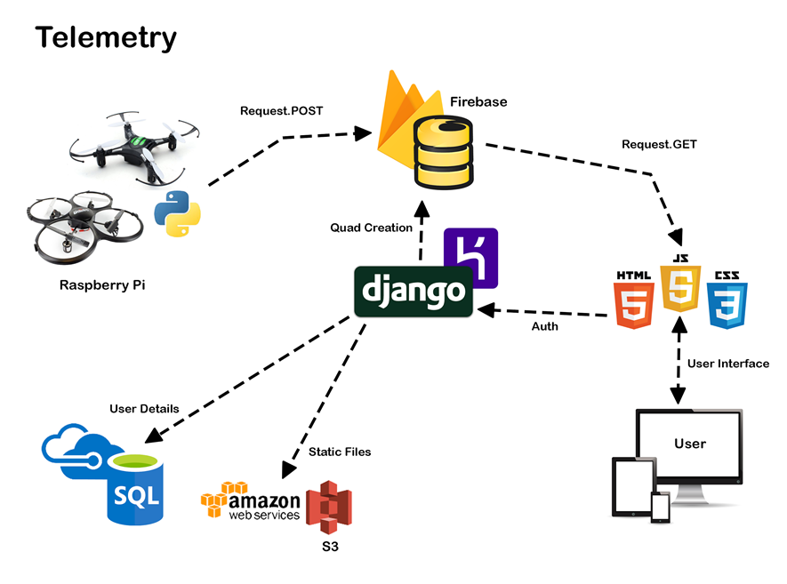

# Quadlink

How it works:

Your quadcopter will post asyncronously to a remote database, this can be done with a data dongle or wifi connection. Because the data is updated contineously and stored any user with the right credentials can connect to the remote database and access the most up to data. The data will also update real time to every connected user

Set up the QuadJavelin on your raspberry pi, entering the right parameters { username password Number_of_threads }, connect to https://quadlink.herokuapp.com. To connect to correct quadcopter type the username and password if turn_on.sh has been run graphs showing the acceleration, throttle output and x y z data will show.

